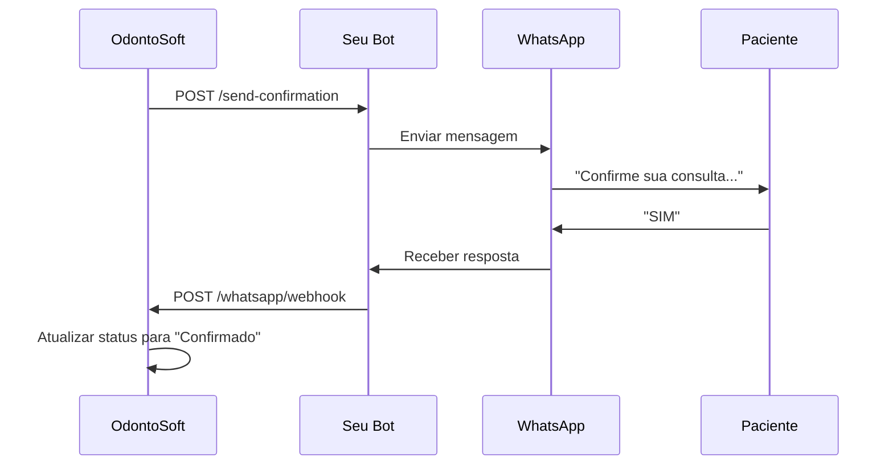
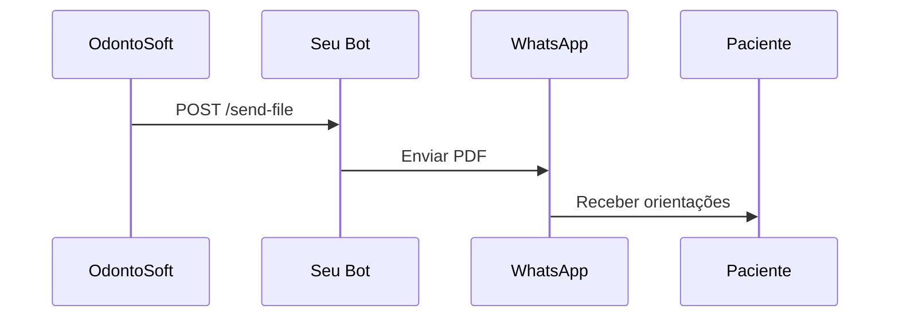
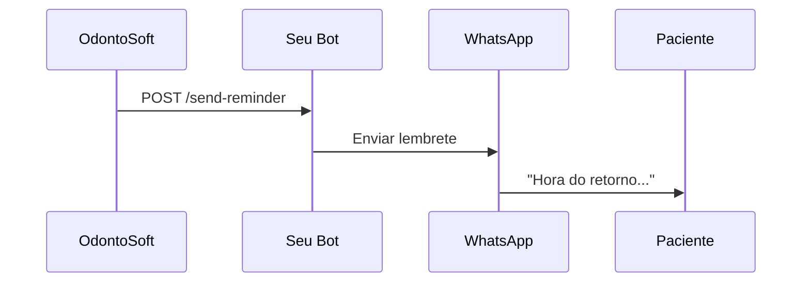

# 🔗 Guia de Integração WhatsApp

Este documento explica como integrar o OdontoSoft com seu bot WhatsApp existente.

## 📋 Visão Geral

O OdontoSoft foi projetado para trabalhar em conjunto com seu bot WhatsApp existente, mantendo-os completamente separados para evitar qualquer interferência. A comunicação acontece via APIs REST.

## 🏗️ Arquitetura da Integração

```
┌─────────────────┐    API REST    ┌─────────────────┐    WhatsApp API    ┌─────────────────┐
│   OdontoSoft    │ ──────────────► │   Seu Bot       │ ──────────────────► │   WhatsApp      │
│   (Backend)     │                │   WhatsApp      │                    │   Business      │
└─────────────────┘                └─────────────────┘                    └─────────────────┘
```

## 🔧 Configuração Necessária

### 1. No Seu Bot WhatsApp

Você precisará adicionar endpoints no seu bot para:

#### A) Receber comandos do OdontoSoft
```javascript
// Endpoint para enviar mensagens
app.post('/send-message', (req, res) => {
    const { phone, message } = req.body;
    
    // Sua lógica para enviar mensagem via WhatsApp
    // Exemplo usando whatsapp-web.js ou baileys
    
    res.json({ success: true, message_id: 'msg_123' });
});

// Endpoint para enviar arquivos
app.post('/send-file', (req, res) => {
    const { phone, file_path, caption } = req.body;
    
    // Sua lógica para enviar arquivo via WhatsApp
    
    res.json({ success: true, file_sent: true });
});
```

#### B) Enviar respostas para o OdontoSoft
```javascript
// Quando receber uma mensagem no WhatsApp
client.on('message', async (message) => {
    // Enviar para o OdontoSoft processar
    await fetch('http://localhost:5000/whatsapp/webhook', {
        method: 'POST',
        headers: { 'Content-Type': 'application/json' },
        body: JSON.stringify({
            phone: message.from,
            message: message.body,
            timestamp: new Date().toISOString()
        })
    });
});
```

### 2. No OdontoSoft

Configure a URL do seu bot:

```bash
curl -X POST http://localhost:5000/whatsapp/configure \
  -H "Content-Type: application/json" \
  -d '{
    "bot_url": "http://localhost:3000",
    "api_key": "sua_chave_opcional"
  }'
```

## 📡 Endpoints Disponíveis

### OdontoSoft → Seu Bot

| Endpoint | Método | Descrição |
|----------|--------|-----------|
| `/send-message` | POST | Enviar mensagem simples |
| `/send-file` | POST | Enviar arquivo (PDF, imagem) |
| `/send-confirmation` | POST | Enviar confirmação de consulta |
| `/send-reminder` | POST | Enviar lembrete de retorno |

### Seu Bot → OdontoSoft

| Endpoint | Método | Descrição |
|----------|--------|-----------|
| `/whatsapp/webhook` | POST | Receber mensagens/respostas |
| `/whatsapp/send-message` | POST | Enviar mensagem via OdontoSoft |
| `/whatsapp/send-confirmation/<id>` | POST | Enviar confirmação específica |

## 🔄 Fluxos de Integração

### 1. Confirmação de Consulta (24h antes)



### 2. Envio de Arquivos Pós-Consulta



### 3. Lembretes de Retorno



## 📝 Exemplos de Implementação

### Exemplo 1: Integração Básica (Node.js)

```javascript
const express = require('express');
const app = express();

// Middleware
app.use(express.json());

// Endpoint para receber comandos do OdontoSoft
app.post('/send-message', async (req, res) => {
    try {
        const { phone, message } = req.body;
        
        // Sua lógica de envio aqui
        // await client.sendText(phone, message);
        
        res.json({ 
            success: true, 
            message_id: `msg_${Date.now()}`,
            phone: phone 
        });
    } catch (error) {
        res.status(500).json({ 
            success: false, 
            error: error.message 
        });
    }
});

// Endpoint para enviar arquivos
app.post('/send-file', async (req, res) => {
    try {
        const { phone, file_path, caption } = req.body;
        
        // Sua lógica de envio de arquivo aqui
        // await client.sendFile(phone, file_path, 'arquivo.pdf', caption);
        
        res.json({ 
            success: true, 
            file_sent: true,
            phone: phone 
        });
    } catch (error) {
        res.status(500).json({ 
            success: false, 
            error: error.message 
        });
    }
});

app.listen(3000, () => {
    console.log('Bot WhatsApp rodando na porta 3000');
});
```

### Exemplo 2: Webhook para Respostas

```javascript
// No seu bot, quando receber mensagens
client.on('message', async (message) => {
    // Filtrar apenas respostas relevantes
    const relevantResponses = ['SIM', 'NÃO', 'REAGENDAR', 'S', 'N'];
    
    if (relevantResponses.includes(message.body.toUpperCase())) {
        try {
            await fetch('http://localhost:5000/whatsapp/webhook', {
                method: 'POST',
                headers: { 'Content-Type': 'application/json' },
                body: JSON.stringify({
                    phone: message.from.replace('@c.us', ''),
                    message: message.body,
                    timestamp: new Date().toISOString(),
                    message_id: message.id
                })
            });
        } catch (error) {
            console.error('Erro ao enviar para OdontoSoft:', error);
        }
    }
});
```

## 🔒 Segurança

### Autenticação (Opcional)

Se você quiser adicionar uma camada de segurança:

```javascript
// No seu bot
const API_KEY = 'sua_chave_secreta';

app.use((req, res, next) => {
    const authHeader = req.headers.authorization;
    
    if (authHeader && authHeader === `Bearer ${API_KEY}`) {
        next();
    } else {
        res.status(401).json({ error: 'Não autorizado' });
    }
});
```

### Validação de Origem

```javascript
// Validar se a requisição vem do OdontoSoft
const ALLOWED_IPS = ['127.0.0.1', 'localhost'];

app.use((req, res, next) => {
    const clientIP = req.ip || req.connection.remoteAddress;
    
    if (ALLOWED_IPS.includes(clientIP)) {
        next();
    } else {
        res.status(403).json({ error: 'IP não autorizado' });
    }
});
```

## 🧪 Testando a Integração

### 1. Teste de Conectividade

```bash
# Testar se o bot está respondendo
curl -X POST http://localhost:3000/send-message \
  -H "Content-Type: application/json" \
  -d '{
    "phone": "5511999999999",
    "message": "Teste de conectividade"
  }'
```

### 2. Teste de Confirmação

```bash
# Enviar confirmação via OdontoSoft
curl -X POST http://localhost:5000/whatsapp/send-confirmation/1 \
  -H "Content-Type: application/json"
```

### 3. Teste de Webhook

```bash
# Simular resposta do paciente
curl -X POST http://localhost:5000/whatsapp/webhook \
  -H "Content-Type: application/json" \
  -d '{
    "phone": "5511999999999",
    "message": "SIM",
    "timestamp": "2024-01-01T10:00:00Z"
  }'
```

## 🚀 Automação

### Configurar Cron Job para Confirmações

```bash
# Adicionar ao crontab para enviar confirmações diariamente às 9h
0 9 * * * curl -X POST http://localhost:5000/automation/send-all-confirmations
```

### Script de Monitoramento

```bash
#!/bin/bash
# monitor_integration.sh

# Verificar se o OdontoSoft está rodando
if ! curl -s http://localhost:5000/ > /dev/null; then
    echo "OdontoSoft offline!"
    # Enviar alerta
fi

# Verificar se o bot está rodando
if ! curl -s http://localhost:3000/health > /dev/null; then
    echo "Bot WhatsApp offline!"
    # Enviar alerta
fi
```

## 📞 Suporte

Se você encontrar dificuldades na integração:

1. Verifique se ambos os serviços estão rodando
2. Confirme se as URLs estão corretas
3. Teste os endpoints individualmente
4. Verifique os logs de ambos os sistemas

## 🔄 Próximos Passos

Após a integração básica:

1. Implementar envio de arquivos
2. Configurar lembretes automáticos
3. Adicionar logs detalhados
4. Implementar retry automático para falhas
5. Configurar monitoramento

